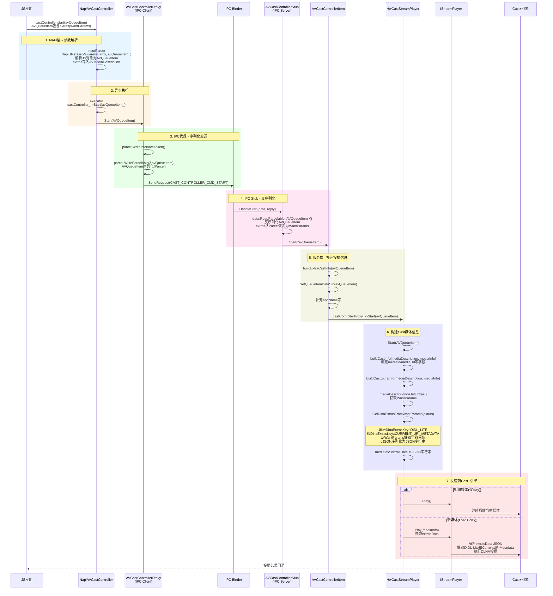

# DLNA投播自定义扩展参数 - 从NAPI到Cast+的时序图

## 时序图



## 数据流转说明

| 阶段 | 数据结构 | 说明 |
|------|---------|------|
| JS应用 → NAPI | `AVQueueItem`(JS对象) | extras作为WantParams存储在AVMediaDescription中 |
| NAPI → IPC Proxy | `AVQueueItem`(C++对象) | 通过`NapiUtils::GetValue`解析JS对象为Native对象 |
| IPC Proxy → IPC Stub | `MessageParcel`(序列化) | AVQueueItem通过Parcel序列化传输，extras作为WantParams序列化 |
| IPC Stub → Item | `AVQueueItem`(C++对象) | 从Parcel反序列化恢复AVQueueItem |
| Item → Player | `AVQueueItem`(C++对象) | 补充appName等额外信息后传递 |
| Player内部 | `WantParams` → `std::string` | `GetDlnaExtrasFromWantParams`将WantParams转为JSON字符串 |
| Player → Cast+ | `CastEngine::MediaInfo` | extrasData字段携带DLNA参数JSON |

## DLNA Extras JSON格式示例

```json
{
    "DIDL-Lite": "<DIDL-Lite xmlns=\"urn:schemas-upnp-org:DIDL-Lite\">...</DIDL-Lite>",
    "CurrentURIMetadata": "<DIDL-Lite xmlns=\"urn:schemas-upnp-org:DIDL-Lite\">...</DIDL-Lite>"
}
```

## 关键源文件

| 组件 | 文件路径 |
|------|---------|
| NAPI入口 | `frameworks/js/napi/session/src/napi_avcast_controller.cpp:240` |
| ExtraKey枚举导出 | `frameworks/js/napi/session/src/napi_avsession_enum.cpp` |
| IPC Proxy | `services/session/ipc/proxy/avcast_controller_proxy.cpp:78` |
| IPC Stub | `services/session/ipc/stub/avcast_controller_stub.cpp:96` |
| 服务端Item | `services/session/server/avcast_controller_item.cpp:235` |
| StreamPlayer | `services/session/server/hw_cast_stream_player.cpp:203` |
| DLNA解析 | `services/session/server/hw_cast_stream_player.cpp:340` |
| 常量定义 | `interfaces/inner_api/native/session/include/avsession_info.h` |
